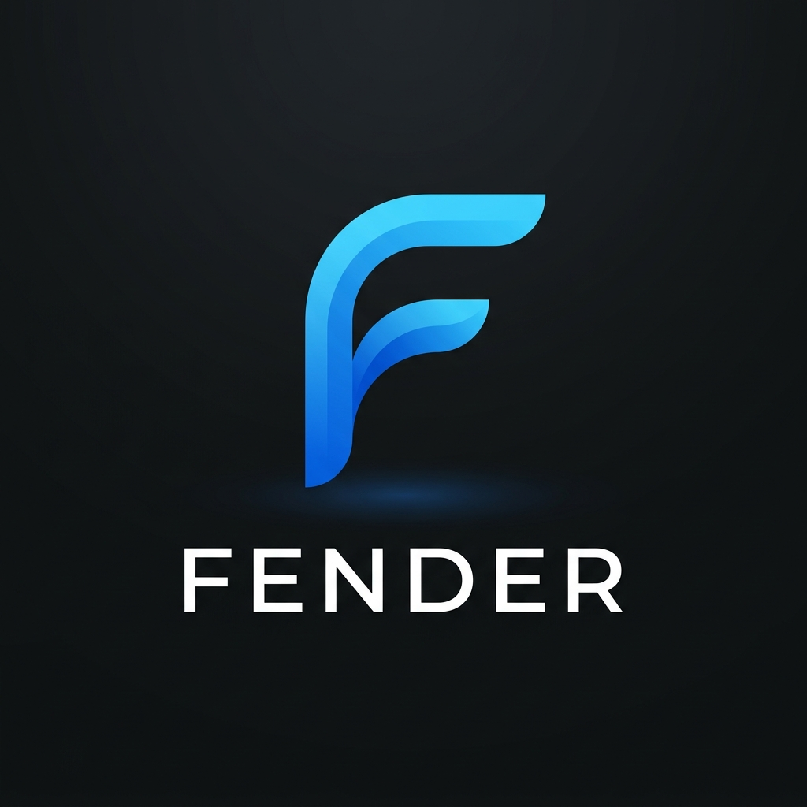

<p align="center">
  
</p>

<h1 align="center">fender</h1>

<p align="center">
  <strong>Fix Docker Hub rate limits without touching your Dockerfiles.</strong><br>
  Redirect every <code>docker pull</code>, <code>docker run</code>, and <code>docker build</code> to your own registry mirror, locally or in CI.
</p>

<p align="center">
  <a href="https://github.com/fender-proxy/fender/releases/latest"></a>
  <a href="https://github.com/fender-proxy/fender/actions/workflows/ci.yml"></a>
  <a href="go.mod"></a>
  <a href="LICENSE"></a>
</p>

---

Does this look familiar?

```text
Error response from daemon: toomanyrequests: You have reached your pull rate limit.
You may increase the limit by authenticating and upgrading: https://www.docker.com/increase-rate-limit
```

Docker Hub [limits how many images you can pull](https://docs.docker.com/docker-hub/usage/), and CI runners that share an IP address hit that limit fast. The usual fix is to pull from a mirror such as Harbor, Nexus, Artifactory, or AWS ECR. That normally means rewriting every `FROM` line and every `docker pull`, or editing `daemon.json` as root.

**fender does the redirect for you.** It's a small Go binary that sits between the Docker CLI and the Docker daemon and rewrites image names on the fly. You keep typing `docker pull nginx`, and the image comes from your mirror.

```bash
fender --default-registry registry.example.com

docker pull nginx:latest   # actually pulls registry.example.com/library/nginx:latest
```

When fender stops, your Docker setup goes back to exactly how it was.

## Contents

- [Why fender?](#why-fender)
- [Quick start](#quick-start)
- [GitHub Actions](#github-actions)
- [GitLab CI](#gitlab-ci)
- [Configuration](#configuration)
- [Registry authentication](#registry-authentication)
- [Rewriting rules](#rewriting-rules)
- [How it works](#how-it-works)
- [FAQ](#faq)
- [Development](#development)

---

## Why fender?

- **Stops `429 Too Many Requests` errors.** Route Docker Hub pulls through an internal mirror or pull-through cache: Harbor, Sonatype Nexus, JFrog Artifactory, AWS ECR pull-through cache, GCP Artifact Registry, or the GitLab Dependency Proxy.
- **No root access and no `daemon.json`.** Docker's built-in `registry-mirrors` setting requires editing `/etc/docker/daemon.json` and restarting `dockerd`. You can't do that on GitHub-hosted runners or locked-down machines. fender runs entirely in user space.
- **Mirrors any registry, not just Docker Hub.** Docker's built-in mirror only works for `docker.io`. fender can also redirect `ghcr.io`, `quay.io`, or any other registry.
- **No code changes.** Developers keep writing `FROM python:3.11-slim` and `docker pull nginx`. You don't have to edit hundreds of repositories across teams.
- **Works with `docker build`.** fender rewrites `FROM` lines in Dockerfiles, including BuildKit builds.

### How it compares

| | fender | `registry-mirrors` in `daemon.json` | Rewriting image names by hand |
|---|:---:|:---:|:---:|
| No root or daemon restart | ✅ | ❌ | ✅ |
| Works on GitHub-hosted runners | ✅ | ❌ | ✅ |
| Mirrors registries other than Docker Hub | ✅ | ❌ | ✅ |
| No Dockerfile or script changes | ✅ | ✅ | ❌ |
| Rewrites `FROM` in `docker build` | ✅ | ✅ | ❌ |
| Injects mirror credentials automatically | ✅ | ❌ | ❌ |

---

## Quick start

fender runs on **Linux and macOS** (amd64 and arm64).

### 1. Install

**Download a prebuilt binary** from the [latest release](https://github.com/fender-proxy/fender/releases/latest):

```bash
# Pick one: linux_amd64, linux_arm64, darwin_amd64, darwin_arm64
curl -fsSL https://github.com/fender-proxy/fender/releases/latest/download/fender_linux_amd64.tar.gz \
  | tar -xz fender
sudo mv fender /usr/local/bin/
```

**Or install with Go** (requires the Go version listed in [`go.mod`](go.mod)):

```bash
go install github.com/fender-proxy/fender@latest
```

**Or build from source:**

```bash
git clone https://github.com/fender-proxy/fender
cd fender
make install   # → $GOPATH/bin/fender
```

### 2. Run

```bash
fender --default-registry registry.example.com
```

On startup, fender:

1. Detects your active Docker context and uses its socket as the upstream.
2. Creates a Docker context called `fender` that points to its own socket.
3. Makes `fender` the active context.

```
time=… level=INFO  msg="fender ready"
  upstream_source="Docker context \"desktop-linux\""
  upstream=/Users/you/.docker/run/docker.sock
  default_registry=registry.example.com
  context_watching=true

✓ Docker context "fender" is now active — no DOCKER_HOST export needed.
```

### 3. Use Docker as usual

```bash
docker pull nginx:latest      # → registry.example.com/library/nginx:latest
docker run ubuntu:22.04 id    # → registry.example.com/library/ubuntu:22.04
docker pull ghcr.io/org/app   # → unchanged (explicit registry)
```

When you stop fender (Ctrl-C or SIGTERM), it removes the `fender` context and switches you back to your previous one.

---

## GitHub Actions

Add one step before anything that uses Docker:

```yaml
steps:
  - uses: fender-proxy/fender@v0.3.2
    with:
      default-registry: registry.example.com

  - run: docker pull nginx    # → registry.example.com/library/nginx
```

You don't need to export `DOCKER_HOST`. fender makes itself the active Docker context, so later steps pick it up automatically.

### Inputs

| Input | Description | Default |
|---|---|---|
| `version` | fender release tag | `latest` |
| `default-registry` | Registry for unqualified images | — |
| `registry-map` | Newline-separated `source: target` remappings | — |
| `auths` | Newline-separated registry credentials | — |
| `log-level` | `debug\|info\|warn\|error` | `info` |

### Outputs

| Output | Description |
|---|---|
| `socket` | Absolute path to the fender Unix socket |
| `version` | The fender version that was installed |

### Example: mirror Docker Hub and GHCR through Nexus

```yaml
- uses: fender-proxy/fender@v0.3.2
  with:
    registry-map: |
      docker.io: nexus.corp/dockerhub-proxy
      ghcr.io:   nexus.corp/ghcr-proxy
```

---

## GitLab CI

fender ships as a [GitLab CI/CD component](https://docs.gitlab.com/ee/ci/components/):

```yaml
include:
  - component: gitlab.com/fender-proxy/fender/fender@~latest
    inputs:
      default-registry: registry.example.com

build:
  extends: .fender
  script:
    - docker pull nginx    # → registry.example.com/library/nginx
```

`DOCKER_HOST` is set in the job automatically.

### Inputs

| Input | Description | Default |
|---|---|---|
| `version` | fender release tag | `latest` |
| `default-registry` | Registry for unqualified images | — |
| `registry-map` | Newline-separated `source: target` remappings | — |
| `auths` | Newline-separated registry credentials | — |
| `log-level` | `debug\|info\|warn\|error` | `info` |

---

## Configuration

fender works with zero config. Settings are applied in this order (highest priority first):

```
CLI flags  >  FENDER_* env vars  >  ~/.fender/config.yaml  >  defaults
```

To start from the example config:

```bash
mkdir -p ~/.fender
cp .fender.yaml.example ~/.fender/config.yaml
```

### `~/.fender/config.yaml`

```yaml
# Socket fender listens on.
listen: "~/.fender/fender.sock"

# Upstream Docker socket.
# Default: auto-detected from the active Docker context.
# Set explicitly to pin a socket and disable context watching.
upstream: ""

# Prepend this registry to images that have no explicit registry.
# The Docker CLI normalises bare names (e.g. nginx) to docker.io/* before
# the API call, so fender intercepts docker.io references too.
default_registry: ""

# Per-registry rewrites (applied after default_registry).
registry_map:
  # docker.io: nexus.corp/dockerhub-proxy
  # ghcr.io:   nexus.corp/ghcr-proxy

# Standalone registry authentication details (optional).
auths:
  # registry.example.com:
  #   username: "user"
  #   password: "password"

# debug | info | warn | error
log_level: "info"
```

### CLI flags

| Flag | Env var | Default |
|---|---|---|
| `--listen` | `FENDER_LISTEN` | `~/.fender/fender.sock` |
| `--upstream` | `FENDER_UPSTREAM` | _(auto-detected from Docker context)_ |
| `--default-registry` | `FENDER_DEFAULT_REGISTRY` | _(none)_ |
| `--default-registry-username` | `FENDER_DEFAULT_REGISTRY_USERNAME` | _(none)_ |
| `--default-registry-password` | `FENDER_DEFAULT_REGISTRY_PASSWORD` | _(none)_ |
| `--default-registry-token` | `FENDER_DEFAULT_REGISTRY_TOKEN` | _(none)_ |
| `--default-registry-email` | `FENDER_DEFAULT_REGISTRY_EMAIL` | _(none)_ |
| `--registry-auth` | `FENDER_REGISTRY_AUTHS` | _(none)_ |
| `--log-level` | `FENDER_LOG_LEVEL` | `info` |
| `--config` | — | `~/.fender/config.yaml` |

> Setting `--upstream` explicitly disables context auto-detection and context watching.

---

## Registry authentication

If your mirror needs credentials, fender adds them for you. When it rewrites an image to a different registry, it sets the `X-Registry-Auth` header to the credentials for the destination registry.

There are three ways to configure credentials.

### 1. An `auths` block (recommended)

```yaml
auths:
  registry.example.com:
    username: myuser
    password: mypassword
```

### 2. Inline with the registry

```yaml
default_registry:
  name: registry.example.com
  username: myuser
  password: mypassword

registry_map:
  ghcr.io:
    name: nexus.corp/ghcr-proxy
    username: myuser
    password: mypassword
```

### 3. From CI secrets

**GitHub Actions:**

```yaml
- uses: fender-proxy/fender@v0.3.2
  with:
    default-registry: registry.example.com
    auths: |
      registry.example.com:
        username: ${{ secrets.REG_USER }}
        password: ${{ secrets.REG_PWD }}
```

**GitLab CI:**

```yaml
include:
  - component: gitlab.com/fender-proxy/fender/fender@~latest
    inputs:
      default-registry: registry.example.com
      auths: |
        registry.example.com:
          username: $REG_USER
          password: $REG_PASSWORD
```

---

## Rewriting rules

### `default_registry`

Redirects images that have no explicit registry. The Docker CLI turns bare names like `nginx` into `docker.io/library/nginx` before sending them, so fender treats `docker.io` images the same way:

| What you type | What Docker CLI sends | What fender forwards |
|---|---|---|
| `nginx:latest` | `docker.io/library/nginx:latest` | `registry.example.com/library/nginx:latest` |
| `myorg/app:v1` | `docker.io/myorg/app:v1` | `registry.example.com/myorg/app:v1` |
| `ghcr.io/org/app` | `ghcr.io/org/app` | _(unchanged — explicit registry)_ |

### `registry_map`

Redirects specific source registries. You can use it together with `default_registry` or on its own:

```yaml
registry_map:
  docker.io: nexus.corp/dockerhub-proxy
  ghcr.io:   nexus.corp/ghcr-proxy
```

| Docker CLI sends | fender forwards |
|---|---|
| `docker.io/library/nginx:latest` | `nexus.corp/dockerhub-proxy/library/nginx:latest` |
| `docker.io/myorg/app:v1` | `nexus.corp/dockerhub-proxy/myorg/app:v1` |
| `ghcr.io/org/app:v1` | `nexus.corp/ghcr-proxy/org/app:v1` |

---

## How it works

```
docker pull nginx:latest       # you type this
         │
         ▼  Docker context: "fender"  (~/.fender/fender.sock)
   ┌─────────────────────────────────────────────────────────┐
   │                      fender                             │
   │  docker.io/library/nginx:latest                         │
   │         ↓  rewrite                                      │
   │  registry.example.com/library/nginx:latest              │
   └─────────────────────────────────────────────────────────┘
         │
         ▼  upstream: active Docker context before fender started
   Docker Daemon
```

fender is a reverse proxy on a Unix socket. It registers itself as a Docker context, so the Docker CLI sends its API calls to fender. fender rewrites image names in the requests it cares about and passes everything else through unchanged.

### Startup and per-request flow

```
┌──────────────────────────────────────────────────────────────┐
│  Startup                                                      │
│  1. Resolve upstream: DOCKER_HOST → active context → default  │
│  2. Start proxy on ~/.fender/fender.sock                      │
│  3. Write ~/.docker/contexts/meta/<sha256>/meta.json          │
│     (stores PreviousContext for crash recovery)               │
│  4. Set currentContext = "fender" in ~/.docker/config.json    │
│  5. Start fsnotify watcher on ~/.docker/                      │
│  6. Load embedded fender-frontend:local image into daemon     │
└──────────────────────────────────────────────────────────────┘
         │  all Docker tooling now routes here
         ▼
┌──────────────────────────────────────────────────────────────┐
│  Per request                                                  │
│  POST /containers/create   → rewrite Image field in JSON body │
│  POST /images/create       → rewrite fromImage query param    │
│  /images/{name}/…          → rewrite name in URL path         │
│  /Control/Solve (gRPC)     → inject fender-frontend           │
│  everything else           → pass-through                     │
└──────────────────────────────────────────────────────────────┘
         │
         ▼  dynamically updated upstream socket
   Docker Daemon
```

fender uses Go's `httputil.ReverseProxy` over a Unix socket transport. The upstream socket is stored behind a `sync.RWMutex`, so `UpdateUpstream` can swap it live when the context watcher fires without dropping in-flight requests.

### Docker API endpoints intercepted

| Endpoint | What's rewritten |
|---|---|
| `POST /v*/containers/create` | `Image` field in JSON body (`docker run`) |
| `POST /v*/images/create` | `fromImage` query param (`docker pull`) |
| `GET /v*/images/{name}/json` | `{name}` path segment |
| `DELETE /v*/images/{name}` | `{name}` path segment |
| `POST /v*/images/{name}/push` | `{name}` path segment |
| `GET /v*/images/{name}/history` | `{name}` path segment |
| `POST /v*/images/{name}/tag` | `{name}` path segment |
| `/moby.buildkit.v1.Control/Solve` | BuildKit `SolveRequest` frontend source and options (`docker build`) |
| Everything else | Pass-through, byte-for-byte (streaming preserved) |

> **`docker build` and `FROM` lines:** fender rewrites `FROM` lines even with BuildKit (`DOCKER_BUILDKIT=1`). It intercepts the gRPC `Solve` call and swaps in an embedded BuildKit frontend (`fender-frontend:local`). That frontend rewrites base image references in the Dockerfile, then hands off to the standard Dockerfile compiler.

### Context awareness

fender finds the active Docker context the same way the Docker CLI does:

```
DOCKER_HOST env var
  → ~/.docker/config.json  (currentContext field)
      → ~/.docker/contexts/meta/<sha256>/meta.json
  → platform default  (/var/run/docker.sock or ~/.docker/run/docker.sock)
```

It also watches `~/.docker/` with `fsnotify`. If you switch contexts while fender is running, fender picks up the new socket immediately, with no restart:

```bash
# fender is running…
docker context use my-other-context

# fender logs:
# level=INFO msg="Docker context changed — updating upstream"
#   source="Docker context \"my-other-context\""
#   new_socket=/path/to/other.sock
```

### Crash recovery

If fender exits without cleaning up (for example after a power loss or `kill -9`), it leaves a `fender` context behind. On the next run, fender finds that stale context, reads the previous context it saved in the context metadata, and recovers on its own.

---

## FAQ

### How do I fix "toomanyrequests: You have reached your pull rate limit" in CI?

Point Docker at a registry mirror or pull-through cache instead of Docker Hub. With fender, add the [GitHub Action](#github-actions) or [GitLab component](#gitlab-ci) and set `default-registry` to your mirror. Existing `docker pull`, `docker run`, and `FROM` lines then pull from the mirror without any other changes.

### How is this different from Docker's `registry-mirrors` setting?

`registry-mirrors` lives in `/etc/docker/daemon.json`, needs root, and requires restarting the Docker daemon. It also only mirrors Docker Hub. fender runs as a normal user, needs no restart, works on hosted CI runners, and can redirect any registry, including `ghcr.io` and `quay.io`.

### Do I need to change my Dockerfiles or CI scripts?

No. fender rewrites image names as they pass through, so `FROM nginx` and `docker pull nginx` keep working as written.

### Does it work with `docker build`?

Yes, including BuildKit. fender rewrites `FROM` lines during the build. See [How it works](#how-it-works) for details.

### What happens to my Docker setup when fender stops?

fender removes its `fender` context and switches you back to whatever context you had before. If it crashes, it cleans up on the next run.

### Which registries can I use as a mirror?

Any registry that speaks the Docker Registry HTTP API, including Harbor, Sonatype Nexus, JFrog Artifactory, AWS ECR, GCP Artifact Registry, and the GitLab Dependency Proxy.

### Does fender work on Windows?

Not yet. fender uses Unix sockets and currently supports Linux and macOS.

---

## Development

```bash
make build    # → ./bin/fender
make install  # → $GOPATH/bin/fender
make run      # run locally in debug mode
make test     # run unit tests
make clean    # remove ./bin
```

## Contributing

Bug reports, feature requests, and pull requests are welcome. Please [open an issue](https://github.com/fender-proxy/fender/issues) to discuss larger changes first.

If fender saves you from a rate-limited pipeline, a ⭐ on the repo helps other people find it.

## License

[MIT](LICENSE)
